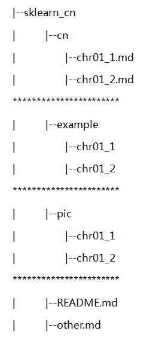

# scikit-learn 中文使用手册

We hope more Chinese could know about this machine learning package scikit-learn

## 致谢

首先，欢迎大家加入到翻译 sklearn 小团体，此次翻译团体有老师，有在读学生，也有在职人员，感谢大家抽出时间翻译 sklearn 使用手册。也非常感谢 sklearn 团队给我们带来了优秀的机器学习库。
下面我将逐一介绍此次翻译工作的内容、注意事项等。

## 翻译人员列表

|  章节  |    翻译人员    |  预计完成时间  |  实际完成时间  |
| ---- | ---- | ---- | ---- | ---- |
|  第1章 |  樊茂华、吕思晨 |   2016/2/15  |              |
|       |    刘洋、?      |   2016/2/15  |              |
|  第2章 |  刘卉、杨林凤   |   2016/2/15  |              |
|       |      熊吉       |   2016/2/15  |              |
|  第3章 |  苑赞、Kris     |   2016/2/15  |              |
|       |       罗伟      |   2016/2/15  |              |
|  第4章 |  唐智雄、黄埔   |   2016/2/15  |              |
|  第5章 |   刘贞、裴志华   |   2016/2/15  |              |
|  第7章 |  张举涛、方文达  |   2016/2/15  |              |

## 书写规范

此次项目所有书写按照 MarkDown规则（节约用时），文本的后缀都使用 .md；这里有MarkDown书写例子：
[https://github.com/guoyunsky/Markdown-Chinese-Demo](https://github.com/guoyunsky/Markdown-Chinese-Demo)
[https://github.com/guodongxiaren/README](https://github.com/guodongxiaren/README)
书写约定：
书名，章名使用一级标题，其他以此类推。

## 目录结构

## 注意事项：

*   只将英文改为中文，不要更改特殊格式或符号，包括（无法详尽，你觉得和普通书写不一样的格式符号即是）：

    *   缩进保留；
    *   空白行要保留；
    *   引号等特殊符号，如 `Bio.Entrez.egquery()` ，前后均保留一个英文字符空格（即半角空格）；
    *   比较复杂的格式，如链接，章节引用，保留原文本，如上，前后留空格即可；

*   代码块不需要翻译，不做任何更改；

*   章节名称：数字用小写，如“第1章”；
*   专有名词及你觉得不好翻译的词记录下来，一起在群里讨论。

## 进度安排

*   15/12月-16/01月：完成主要章节翻译初稿；
*   16/01月-16/02月：讨论，校对；未完成章节翻译；
*   16/02月-16/03月：讨论，校对，定稿，发布

## 例子

一位师兄翻译biopython的例子：
[https://github.com/lijax/biopython](https://github.com/lijax/biopython)